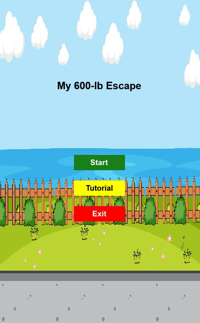
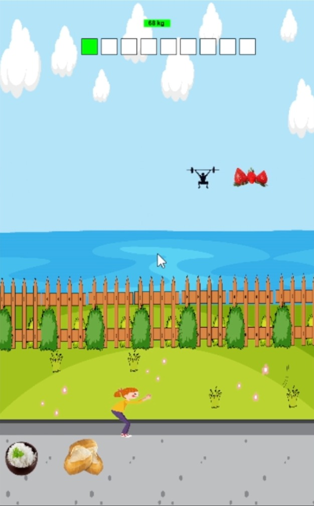
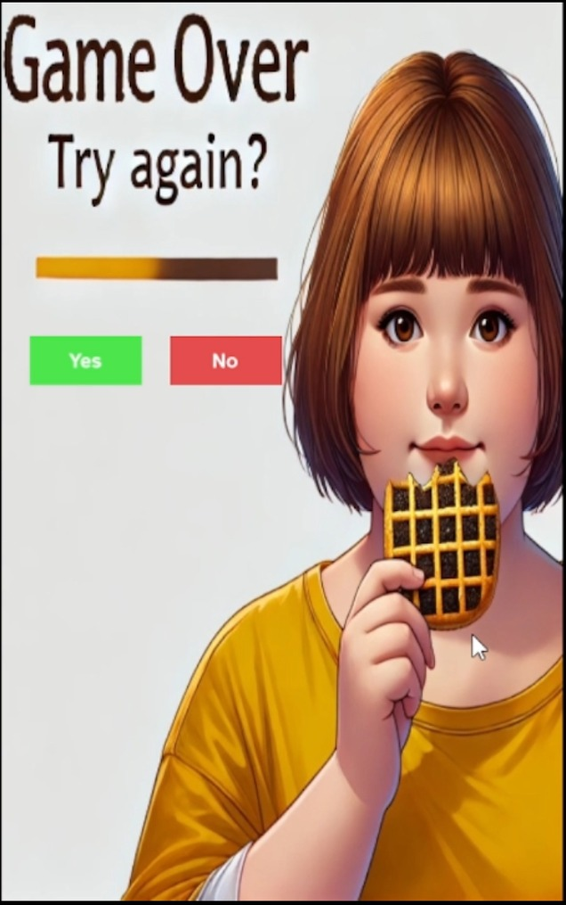
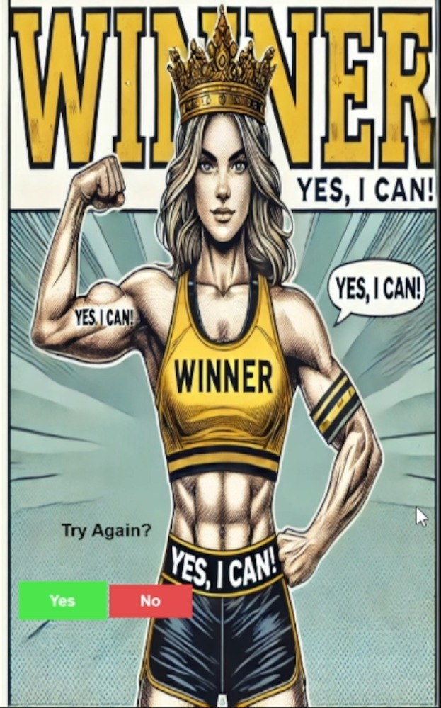

<p align="center">
   
  
 
</p>
  <h1 align="center"></h1>
 <h1 align="center"> My 600lb escape</h1>
<p align="center">
<p align="center">A game about navigating obstacles to achieve a healthy lifestyle, developed with Lua and Solar2D.</p>

### Description

---

"My 600lb Escape" is a lifestyle game where players make choices that affect the character's health and weight. By navigating through obstacles representing lifestyle choices like healthy and unhealthy foods, players gain or lose weight based on their in-game decisions.

---

## **Technologies Used**

- **Lua**: Main programming language for game logic.
- **Solar2D (Corona SDK)**: Platform for developing and rendering the game.
- **JavaScript**: For managing game description and interaction in the user interface.
- **React**: Frontend framework for the user interface.
- **CSS**: Styling for the game UI.
- **HTML**: Structuring the web-based components.

---

### Getting Started-game

```bash
# Clone this project
$ git clone https://github.com/JenniferFariasRodrigues/my-600lb-escape.git

# Access on Eclipse IDE
On IDE choose the option "Import projects". On the folder "General" choose "Existing Projects into workspace" and choose  tricky-trails-obby folder.

# Choose folder in IDE and run the project
Choose "my-600lb-escape" project.
Click on "Run" in the Window.

```

---

## Run the Project

1. In Solar2D, select the project;
2. Select **Open Project** and Choose the folder `my-600lb-escape`;
3. Finally click **Run** to start the game.

## Game Flow

The game consists of phases where players must avoid high-calorie obstacles and aim for those that promote weight loss.

### Game Phases

#### Initial Phase

- **Objective**: Learn the basic game controls.
- **Description**: Players must avoid high-calorie obstacles and interact with healthy ones to gain points and lose weight.
- **Image Preview**:
  <p align="center"> 
   
</p>
  

#### Healthy Choices Phase

- **Objective**: Select low-calorie options while avoiding high-calorie foods to progress.
- **Description**: Navigate through various foods with different calorie values to maintain or reduce weight.
- **Image Preview**:
<p align="center"> 
   
</p>
 

#### Game Over

- **Objective**: Avoid losing by keeping within a healthy calorie range.
- **Image Preview**:
<p align="center"> 
   
</p>

#### Winner Phase

- **Objective**: Celebrate your success after completing the healthy lifestyle challenges.
- **Image Preview**:
<p align="center"> 
   
</p>

 ---

### Video Demonstration

<p align="center">
   <video controls width="650" height="350">
      <source src="public/media/videos/final_video.mp4" type="video/mp4">
      Your browser does not support the video tag.
   </video>
</p>

---

## Project Game Output

### Link to Download Game

**Play now**: [Game Link](https://github.com/JenniferFariasRodrigues/my-600lb-escape)

### Expected Output:

The game interface provides interactive levels as described above.

<p align="center">
  
</p>

---

### **Getting Started-Web page**

```bash
# Clone this project
$ git clone https://github.com/JenniferFariasRodrigues/my-600lb-escape.git
How to Run SnapShot
Navigate to the SnapShot directory:
# Access the Snapshot folder
$ cd SnapShot

Install the dependencies:
$  npm install

Start the development server:
$ npm start
Open your browser and go to http://localhost:3000 to view the application.


SnapShot (React Project)
The SnapShot project is a React-based frontend application that complements the My 600lb Escape game by offering additional features:

Motivação : Displays images of progress ("Before" and "After") to inspire users.
Sobre o jogo: Provides an overview of game phases and video previews.
Galeria VIP: Enables users to search for more information directly from the app.
Contatos: personal data and links about developer.

Key Features
Motivação Section

Displays "Before" and "After" images using responsive layouts.
Images are grouped dynamically with CSS styling for clean presentation.
Images are stored in public/media/images.

Sobre o jogo

Provides details about the game phases.
Features video previews of game stages for better visualization.

Galeria VIP

Provides personal details about the developer's Instagram account.
Videos are stored in public/media/videos.

Contato Section

Lists developer contact information, including:
Email
LinkedIn
GitHub
Stack Overflow
Instagram
Search Feature

Allows users to search for game-related content dynamically.
Search results are displayed directly in the React app.

```
## SnapShot Application Preview-final video

<p align="center">
   <video controls width="650" height="350">
      <source src="Videos_pics/final_video.mp4" type="video/mp4">
      Your browser does not support the video tag.
   </video>
</p>

<p align="center"> <video controls width="650" height="350"> <source src="https://example.com/final_video.mp4" type="video/mp4"> Seu navegador não suporta a tag de vídeo. </video> </p>

## Contribution

Feel free to contribute to this project by submitting pull requests. Please ensure your changes are well-tested and documented.

## License

This project is licensed under the MIT License - see the LICENSE file for details.
