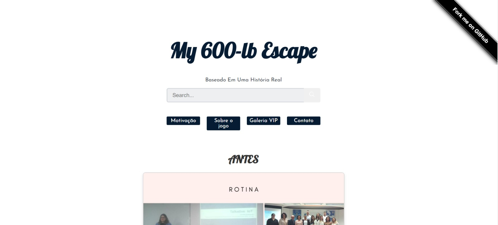

<p align="center">
   
  
 
</p>

  <h1 align="center"></h1>
 <h1 align="center"> My 600-lb escape</h1>
<p align="center">
<p align="center">A game about navigating obstacles to achieve a healthy lifestyle, developed with Lua and Solar2D.</p>

### Description

---

"My 600lb Escape" is a lifestyle game where players make choices that affect the character's health and weight. By navigating through obstacles representing lifestyle choices like healthy and unhealthy foods, players gain or lose weight based on their in-game decisions.

---

## **Technologies Used**

- **Lua**: Main programming language for game logic.
- **Solar2D (Corona SDK)**: Platform for developing and rendering the game.
- **JavaScript**: For managing game description and interaction in the user interface.
- **React**: Frontend framework for the user interface.
- **CSS**: Styling for the game UI.
- **HTML**: Structuring the web-based components.

---

### Getting Started-game

```bash
# Clone this project
$ git clone https://github.com/JenniferFariasRodrigues/my-600lb-escape.git

# Access on Eclipse IDE
On IDE choose the option "Import projects". On the folder "General" choose "Existing Projects into workspace" and choose  tricky-trails-obby folder.

# Choose folder in IDE and run the project
Choose "my-600lb-escape" project.
Click on "Run" in the Window.

```

---

## Run the Project

1. In Solar2D, select the project;
2. Select **Open Project** and Choose the folder `my-600lb-escape`;
3. Finally click **Run** to start the game.

## Game Flow

The game consists of phases where players must avoid high-calorie obstacles and aim for those that promote weight loss.

### Game Phases

#### Initial Phase

- **Objective**: Learn the basic game controls.
- **Description**: Players must avoid high-calorie obstacles and interact with healthy ones to gain points and lose weight.
- **Image Preview**:
  <p align="center"> 
   
</p>
  

#### Healthy Choices Phase

- **Objective**: Select low-calorie options while avoiding high-calorie foods to progress.
- **Description**: Navigate through various foods with different calorie values to maintain or reduce weight.
- **Image Preview**:
<p align="center"> 
   
</p>
 

#### Game Over

- **Objective**: Avoid losing by keeping within a healthy calorie range.
- **Image Preview**:
<p align="center"> 
   
</p>

#### Winner Phase

- **Objective**: Celebrate your success after completing the healthy lifestyle challenges.
- **Image Preview**:
<p align="center"> 
   
</p>


---

## Project Game Output

### Link to Download Game

**Play now**: [Game Link](https://github.com/JenniferFariasRodrigues/my-600lb-escape)

### Expected Output:

The game interface provides interactive levels as described above.

<p align="center">
  
</p>

---

## Web Page

Explore the companion web page for **My 600-lb Escape**, which includes exclusive features like:

- Progress tracking through **"Before" and "After"** images.
- Game phase previews with videos.
- A **VIP Gallery** with personal insights and resources.
- Search functionality for additional content.

<p align="center">
 
 
 
</p>

The web page is built using **React**, **JavaScript**, and **CSS**, ensuring a seamless and interactive experience.

### Web Page Link

[Click here to visit the Web Page](https://github.com/JenniferFariasRodrigues/my-600lb-escape-web-page)

---

<p align="center">
 
</p>

**Note**: The web page complements the game, providing an enhanced experience for players to explore more about **My 600-lb Escape**.

---
